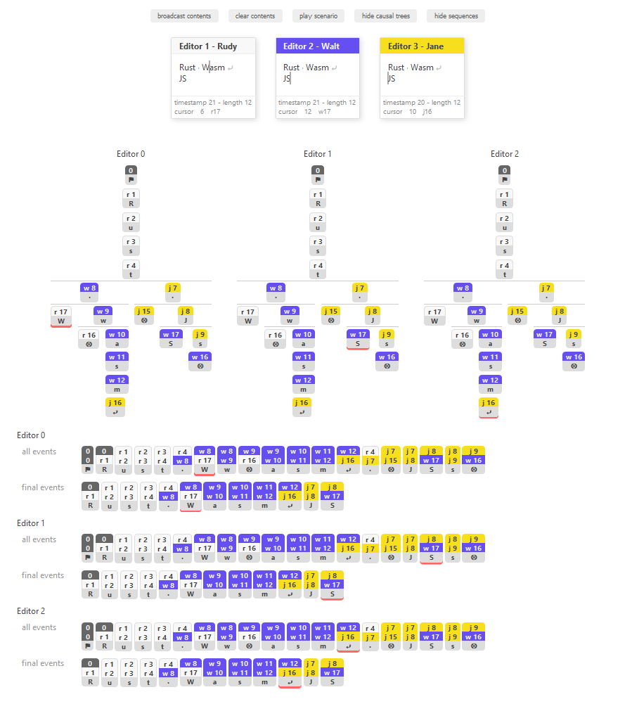

# Code and demo with Rust, WebAssembly and Vue.js

This repo contains the source code and git history for a
[talk](https://sunny-tech.io/schedule/2019-06-28?sessionId=61) I gave at [Sunny
Tech](https://sunny-tech.io/) 2019 conference.

The title of the talk is "A collaborative editor with Rust, WeabAssembly and
Vue.js". Its purpose was to discover Vue.js and Rust, and how to use
[wasm_bindgen](https://github.com/rustwasm/wasm-bindgen) to easily bind Rust and
JavaScript codes using WebAssembly.

# Use case: a collaborative editor

The use case is an offline first collaborative text editor. The code focuses on
UI with Vue.js and a Rust algorithm that ensures content consistency between
editor's instances. The communication between editor's instances is not covered,
and all the editors instances are ran in the same web page.

The consitency algorithm is based on the idea of casual tree as described in this blog
article by [Alexei Baboulevitch](https://twitter.com/archagon): "[Data Laced
with History: Causal Trees & Operational
CRDTs](http://archagon.net/blog/2018/03/24/data-laced-with-history/)".

The algorithm was not detailed during the talk.

In case you want to play with it, the final version of the
[demo](https://ogadaki.gitlab.io/sunnytech-2019-wuer) is hosted on the GitLab
pages of this project.

# A demo split in steps

The different steps for the demo are identified by git tags in the form of
`step-0`, `step-1`, etc. To see the code of a given step one can simply checkout
the corresponding tag:

    $ git checkout step-6

One can also use the `tag` script from the
[denco](https://gitlab.com/ogadaki/denco) tool to go from one step to an other.
Compared to a simple `git checkout`, this tool allows to see differences from
previous step as git diff (in a code editor for example).

# Build and launch demo

Be sure you have rust and wasm-pack installed. Then execute:

    $ yarn install
    $ yarn run start

and open http://localhost:8080.

If you change some code or go from one demo step to another, changes are
detected, build is automatically updated and content reloaded in the browser.

# Screenshot

Here is a screenshot of the final step of the demo, i.e. three editors that edit
contents with occasionnal synchronization (with the broadcast button). This
illustrates how one can use the Rust / JavaScript binding to show how the Rust
algorithm works using dynamic and interactive visualisations.

